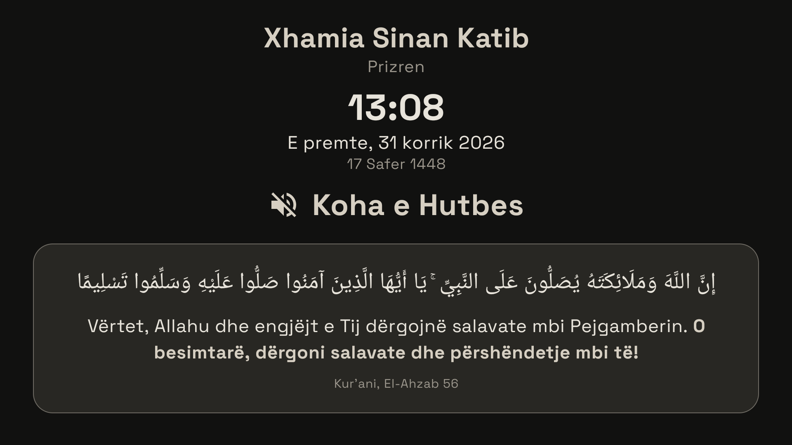
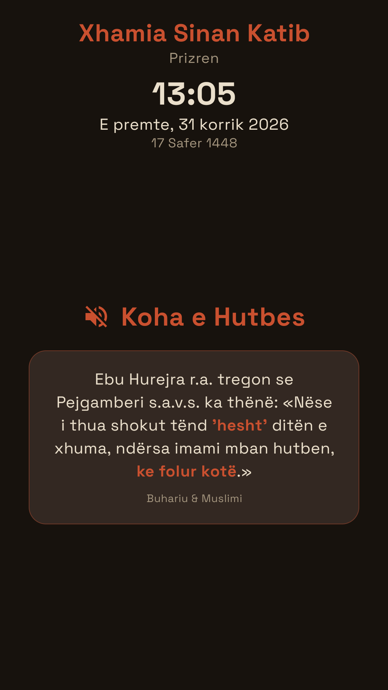

# PrimeMosque

Offline prayer-times display (digital signage) for Android TV / Google TV, built for mosques in Kosovo. Designed for a TV mounted in **portrait** orientation — the app renders its UI rotated, since TV panels only output landscape. A landscape layout is also available for normally mounted TVs.

Originally built for Xhamia "Sinan Katib" in Prizren, running on a 55" Google TV.

## Features

### Prayer times board
- **Fully offline data** — the yearly BIK Kosovo takvim (from [kohet-e-namazit-kosove-json](https://github.com/drilonjaha/kohet-e-namazit-kosove-json)) is bundled as an asset. The takvim repeats every year, so lookups use month + day only. No network is ever needed for the prayer times themselves.
- **Self-healing clock (NTP)** — TVs have no battery-backed clock, so after a power cut the TV's time is wrong until something re-syncs it. The board doesn't trust the TV clock: the moment *any* network is available it fetches the true time from NTP servers (Google/Cloudflare/pool.ntp.org) and runs on that, re-syncing hourly. Without network it falls back to the TV clock — so either keep the TV on Wi-Fi, or after a power cut briefly share a phone hotspot (or set the TV clock manually).
- **Wrong-clock warning** — the app remembers the latest credible time it has seen; if the TV boots up with its clock *behind* that moment (the tell-tale sign of a power cut) and NTP can't sync, a red banner warns that the prayer times may be wrong, with a button that jumps straight to the TV's network settings. Connect Wi-Fi, press back, and the board fixes itself within seconds.
- All 7 daily times (Imsaku, Sabahu, Lindja e Diellit, Dreka, Ikindia, Akshami, Jacia) with the current prayer highlighted and a live countdown to the next one.
- Live clock, Gregorian + Hijri date, upcoming Islamic events.
- **Full-screen announcement** for one minute at the moment each prayer time arrives ("Koha e Namazit të ...", Xhuma-aware on Fridays).
- **Per-prayer time adjustments** — every displayed time can be corrected by ±minutes from settings; the countdown, announcements, notices and night saver all follow the corrected times. The **Hijri date** can also be corrected by ±days for moon-sighting differences (the White Days reminders follow it).
- Kosovo timezone is hardcoded, so a misconfigured TV clock zone still shows correct local times.

### Jumu'ah & khutbah mode
- **Custom Jumu'ah time** — each mosque can hold Xhuma at its own fixed time (12:00–15:00 in 5-minute steps) or simply follow Dhuhr; the board, announcement, countdown and notices all shift together.
- **Full-screen khutbah mode** — from the Jumu'ah time, for a configurable duration (default 20 min), the whole board is replaced: mosque name, clock and date on top, and in the center a rotating collection of **10 Jumu'ah hadiths and Qur'an verses**. Hadiths are given in full narration form ("Ebu Hurejra r.a. tregon se Pejgamberi s.a.v.s. ka thënë: «…»"), verses include the **original Arabic** above the translation, and the key phrase of each quote is highlighted in the theme accent. A calm crossfade rotates them every 30 seconds.

### Daily wisdom breaks
Every 4 minutes the prayer table steps aside for 90 seconds and the board shows rotating **Qur'an verses and hadiths from Bukhari & Muslim** (khutbah-style card: original Arabic for verses, translation with the key phrase highlighted, source) — 18 texts about praying on time, good character, patience, mercy and good deeds, in all 4 languages. The table then returns automatically. Suppressed during announcements, the khutbah and the night saver, and can be turned off entirely in the Display settings ("Verses & hadiths during the day").

### Custom announcements
Two free-text slots ("Njoftimet") for the mosque's own messages — janaza notices, Ramadan programs, fundraisers. While set, they rotate in the notice card all day alongside the contextual notices. From the portal each announcement can carry an **expiry date** (shown through that day, inclusive) after which it removes itself from the board.

### Ramadan mode
Automatic during the Hijri month of Ramadan (follows the offset-corrected Hijri date; toggleable on the TV and in the portal): the board pins a **Ramazani banner with today's Iftar and the relevant Imsak** (tomorrow's after iftar has passed, for suhoor), the countdown to Maghrib relabels to **"deri në Iftar"**, and the sunnah-fasting reminders (Mon/Thu, White Days) pause since everyone is fasting anyway.

### Contextual notices (rotating card)
A card on the board shows guidance only while it applies, rotating every 30 s when several are active:
- **Friday**: read Surah El-Kehf, the hour of accepted du'a, Jumu'ah preparation sunnahs — and around the khutbah a single exclusive "remain silent" notice.
- **Duha prayer** window (from ~20 min after sunrise until shortly before Dhuhr).
- **Morning dhikr** (Sabahu → sunrise) and **evening dhikr** (Ikindia → Akshami).
- **Sunnah fasting reminders** the evening before: Monday & Thursday fasts, and the White Days (13/14/15 of the Hijri month).

### Weekly lecture banner
A recurring lecture configured on its own settings page: title, day of week, and which prayer it follows (Akshami in summer, Jacia in winter). On that day a pinned banner appears next to the clock showing "Sot pas namazit të Akshamit (19:25)". When the banner is visible, the portrait board scales itself down slightly so everything still fits.

### Night energy saver
Between Jacia (plus a configurable delay, so the congregation still sees the normal board) and Imsaku the display switches to the dark variant of the selected theme and dims the backlight — the mosque is empty, no reason to burn power. The daytime theme returns automatically at Imsak. Note: app-level backlight dimming is ignored by most TV firmwares; the biggest savings come from the TV's own on/off timer (the app resumes from standby right where it was).

### Setup & customisation
- **First-run setup wizard** — on first launch the essential settings (language, city, mosque name, place, orientation, theme) are presented once, so a new mosque can configure the board without discovering the settings screen.
- **Categorised settings** (press OK on the remote): a compact main page with the language plus sub-pages — Xhamia (name, place, city with official minute offsets), Ekrani (orientation, theme, night saver), Xhumaja (Jumu'ah time, khutbah duration), Ligjërata javore, Njoftimet, and Përshtatja e kohëve (per-prayer ±min, Hijri date). Every category row shows a live summary of its values.
- **4 theme families, each light + dark**: Mushaf (cream/red), Zaytun (olive), Nila (indigo), Hibr (paper & ink). Optional **weekly automatic rotation** switches to the next family every Monday — keeping your light/dark preference — so the board never gets monotonous.
- **4 languages**: Shqip, English, Türkçe, Bosanski — including prayer names, notices, dhikr translations, khutbah quotes, Hijri month spellings and date locales. For mixed congregations a **secondary language** can be set (on the TV or from the portal): the whole board then alternates between the two languages every 2 minutes.
- Screen is kept awake permanently (signage use), and a boot receiver relaunches the board after a power cut on firmwares that allow it (elsewhere, set the app as home or open it manually).
- **Corruption-proof storage** — a power cut can kill the TV mid-write; a corrupted settings file no longer bricks the app at startup (it used to require clearing app data). Broken files are replaced with defaults, and the frequently-written runtime state lives in a separate file so the mosque's configuration can't be lost with it.
- Custom adaptive launcher icon and 16:9 Android TV banner (gold mosque on navy gradient); app version shown at the bottom of settings for support.

## Remote control (Imam web portal)

The whole board can be managed from a browser instead of the TV remote: mosque name/place/city, language, orientation, theme (+ weekly rotation), night saver, announcements, weekly lecture, Jumu'ah time and khutbah duration, per-prayer time adjustments and the Hijri offset — plus the **content collections**: the imam can define his own daily Qur'an-verse/hadith list and his own khutbah quotes (with optional Arabic and `**bold**` key-phrase markup); an empty list falls back to the app's built-in texts. The TV listens to its own Firestore document and applies changes within seconds; the board keeps working fully offline (DataStore remains the source of truth on the device).

**How pairing works:** each TV generates a permanent 8-character code, shown at the bottom of the settings screen ("Kodi i portalit"). The imam opens the portal ([webportal/index.html](webportal/index.html)), enters the code once, and gets a simple Albanian form. The code doubles as the access secret — it never leaves the TV screen.

**Admin dashboard (same page):** "Paneli i xhamive" — sign in with the admin Google account (allow-listed by email in [firestore.rules](webportal/firestore.rules)) to see every registered board with a live **online/offline status** (each TV stamps a heartbeat into its document every 5 minutes; a board is shown online while the last stamp is under 12 minutes old, otherwise with its last-seen time) and jump straight into any board's manage page. Each heartbeat also carries the **board's own clock reading and NTP state**: the dashboard compares it against the server timestamp of the same write and shows "ora ✓" or a red "⚠ ora e tabelës gabon ~X min" warning, so a TV displaying wrong prayer times is visible remotely. Only the admin can list boards or delete them — a board code alone still grants access to that one board only.

**Already configured** against the Firebase project **Prime - Prayer Times** (`prime---prayer-times`): the web app is registered, Firestore is live (multi-region `eur3`, production mode) with the rules from [webportal/firestore.rules](webportal/firestore.rules) published, and the config values are in `RemoteControl.kt` and `webportal/index.html`. The Firebase web `apiKey` is not a secret — access control lives entirely in the Firestore rules. To point at a different project: create it in the console, add a Web app, enable Firestore, publish the rules, and swap the three config values in those two files.

**The portal is live at [prime---prayer-times.web.app](https://prime---prayer-times.web.app)** (Firebase Hosting, free Spark tier). To redeploy after editing [webportal/index.html](webportal/index.html): `firebase deploy --only hosting`; rule changes: `firebase deploy --only firestore:rules` (config in [firebase.json](firebase.json), CLI installed via Homebrew/npm, logged in as the admin account).

Sync is one-directional (portal → TV); on first contact the TV publishes its current values so the portal starts from reality. Upgrade path for later: Firebase Auth for imams, per-board access, and more settings (theme, adjustments) in the document.

## Screenshots

<table>
  <tr>
    <td align="center"><b>Portrait board</b> (Mushaf theme)</td>
    <td align="center"><b>Friday</b> — lecture banner, rotating notice card, pinned salawat (Zaytun theme)</td>
  </tr>
  <tr>
    <td></td>
    <td></td>
  </tr>
</table>

**Landscape board on a Friday** (Nila dark theme) — weekly lecture banner and notice card flanking the clock:


**Khutbah mode** (Hibr dark theme) — during the khutbah the board is replaced by rotating Jumu'ah hadiths and verses (Qur'anic Arabic + translation, key phrases highlighted):



<table>
  <tr>
    <td align="center"><b>Khutbah mode</b> in portrait (Mushaf dark theme) — full hadith narration with the key phrase highlighted</td>
  </tr>
  <tr>
    <td></td>
  </tr>
</table>

**Night energy saver** — after Isha the board switches to the selected theme's dark variant (here Zaytun → Zaytun dark), until Imsak:


<table>
  <tr>
    <td align="center"><b>Settings</b> (D-pad driven)</td>
    <td align="center"><b>Weekly lecture sub-page</b></td>
  </tr>
  <tr>
    <td></td>
    <td></td>
  </tr>
</table>

## Tech

Kotlin · Jetpack Compose (Material 3) · MVVM (ViewModel + StateFlow) · DataStore Preferences · kotlinx-serialization · min SDK 26

Notable implementation details:

- `ui/PrayerViewModel.kt` — a single 1-second wall-clock-aligned ticker `Flow` drives everything: board state, countdown, announcements, contextual notices, lecture banner, khutbah mode and the night saver. No alarms or background workers.
- `ui/RotatedLayout.kt` — renders the whole UI rotated by 90/180/270° with swapped measurement constraints, for portrait-mounted TVs.
- `ui/SettingsScreen.kt` — uses an explicit `focusProperties` up/down focus chain, because Compose's geometric D-pad focus search breaks inside a rotated layout. Text settings open an edit dialog on OK-press so the on-screen keyboard doesn't pop up while navigating. A shared `SettingsPage` scaffold powers the main page, the setup wizard and all category sub-pages.
- `ui/Strings.kt` — all four languages live in code as plain data (no Android resources), so language switching is instant and driven by the same settings flow. Khutbah quotes mark key phrases with `**…**`, rendered as accent-coloured bold spans by a tiny markup helper in `DisplayScreen.kt`.

## Build & install

```
gradlew :app:assembleRelease
adb connect <tv-ip>
adb install app/build/outputs/apk/release/app-release.apk
```

The release build is signed with the debug key for easy sideloading — replace with a proper keystore for Play Store distribution.

## Data caveat

The bundled takvim embeds one specific year's DST switchover dates. In other years, times within a few days of the late-March / late-October clock change may be off by up to an hour for those few days only.
