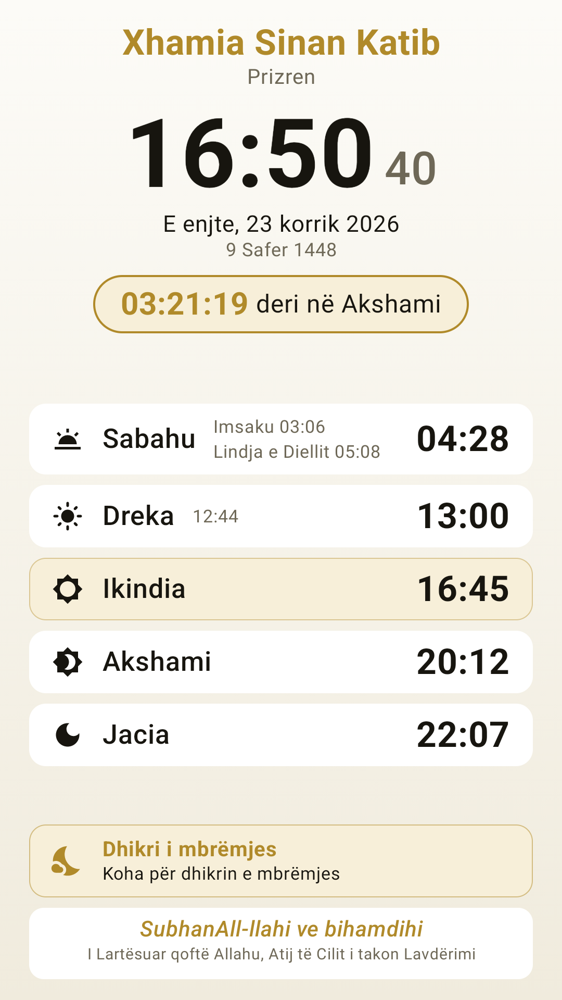
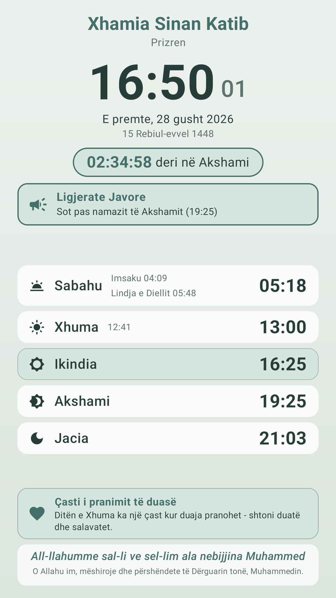
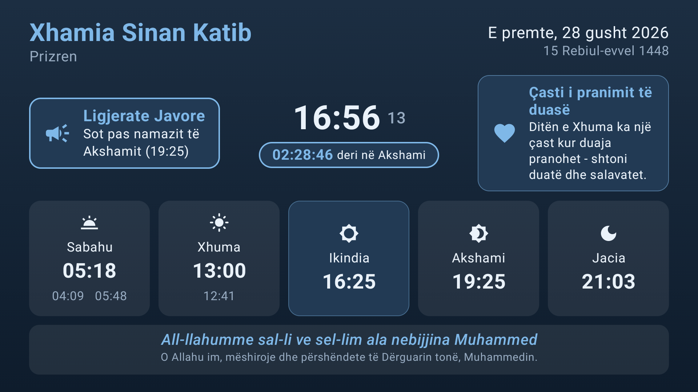
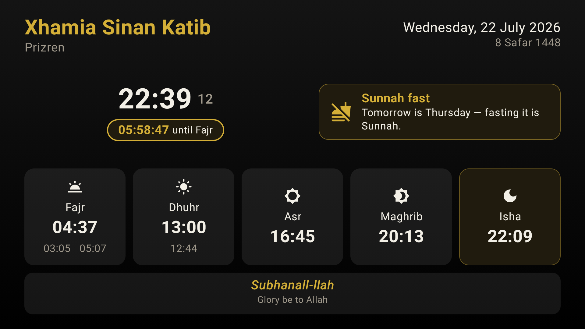
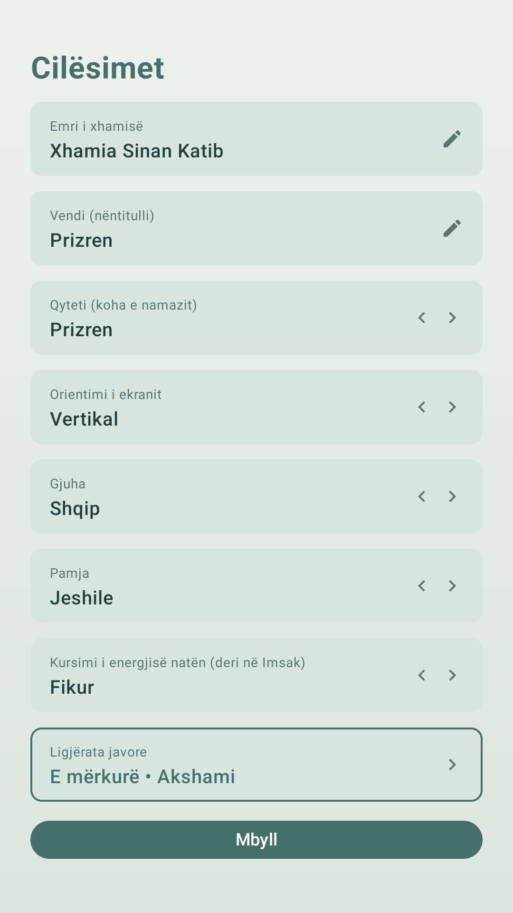
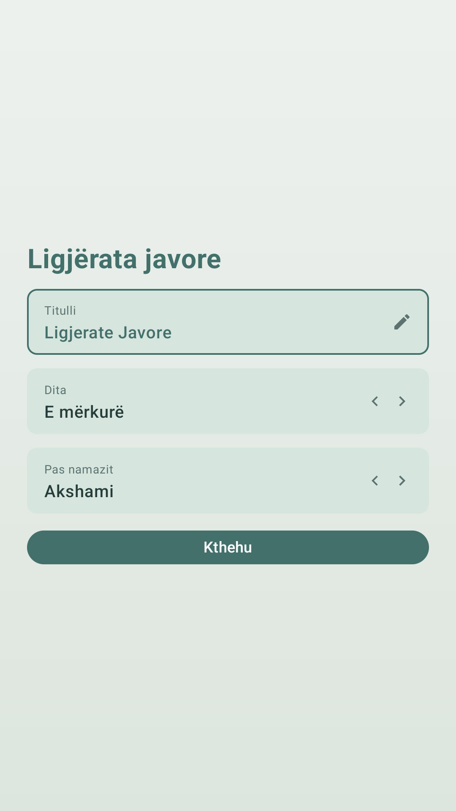

# PrimeMosque

Offline prayer-times display (digital signage) for Android TV / Google TV, built for mosques in Kosovo. Designed for a TV mounted in **portrait** orientation — the app renders its UI rotated, since TV panels only output landscape. A landscape layout is also available for normally mounted TVs.

Originally built for Xhamia "Sinan Katib" in Prizren, running on a 55" Google TV.

## Features

### Prayer times board
- **Fully offline** — the yearly BIK Kosovo takvim (from [kohet-e-namazit-kosove-json](https://github.com/drilonjaha/kohet-e-namazit-kosove-json)) is bundled as an asset. The takvim repeats every year, so lookups use month + day only. No network needed, ever.
- All 7 daily times (Imsaku, Sabahu, Lindja e Diellit, Dreka, Ikindia, Akshami, Jacia) with the current prayer highlighted and a live countdown to the next one.
- Live clock, Gregorian + Hijri date, upcoming Islamic events.
- **Full-screen announcement** for one minute at the moment each prayer time arrives ("Koha e Namazit të ...", Xhuma-aware on Fridays).
- **Per-prayer time adjustments** — every displayed time can be corrected by ±minutes from settings; the countdown, announcements, notices and night saver all follow the corrected times.
- Kosovo timezone is hardcoded, so a misconfigured TV clock zone still shows correct local times.

### Contextual notices (rotating card)
A card on the board shows guidance only while it applies, rotating every 30 s when several are active:
- **Friday**: read Surah El-Kehf, the hour of accepted du'a, Jumu'ah preparation sunnahs — and around the khutbah a single exclusive "remain silent" notice.
- **Duha prayer** window (from ~20 min after sunrise until shortly before Dhuhr).
- **Morning dhikr** (Sabahu → sunrise) and **evening dhikr** (Ikindia → Akshami).
- **Sunnah fasting reminders** the evening before: Monday & Thursday fasts, and the White Days (13/14/15 of the Hijri month).

### Weekly lecture banner
A recurring lecture (e.g. "Zgjimi i Zemrave") configured on its own settings page: title, day of week, and which prayer it follows (Akshami in summer, Jacia in winter). On that day a pinned banner appears next to the clock showing "Sot pas namazit të Akshamit (19:25)". When the banner is visible, the portrait board scales itself down slightly so everything still fits.

### Night energy saver
Between Jacia (plus a configurable delay, so the congregation still sees the normal board) and Imsaku the display switches to the pure-black theme and dims the backlight — the mosque is empty, no reason to burn power. The selected theme returns automatically at Imsak. Note: app-level backlight dimming is ignored by most TV firmwares; the biggest savings come from the TV's own on/off timer (the app resumes from standby right where it was).

### Customisation
- **Settings** (press OK on the remote): mosque name, place, city (all Kosovo cities with official minute offsets), screen orientation (portrait / reversed portrait / landscape / flipped), theme, night saver, plus sub-pages for the weekly lecture and per-prayer time adjustments.
- **9 themes**: Dark, Black, Emerald, Midnight, Burgundy, Light, Gold, Blue, Green.
- **4 languages**: Shqip, English, Türkçe, Bosanski — including prayer names, notices, dhikr translations, Hijri month spellings and date locales.
- Screen is kept awake permanently (signage use).
- Custom adaptive launcher icon and 16:9 Android TV banner (gold mosque on navy gradient).

## Screenshots

<table>
  <tr>
    <td align="center"><b>Portrait board</b> (Gold theme)</td>
    <td align="center"><b>Friday</b> — lecture banner, rotating notice card, pinned salawat (Green theme)</td>
  </tr>
  <tr>
    <td></td>
    <td></td>
  </tr>
</table>

**Landscape board on a Friday** (Midnight theme) — weekly lecture banner and notice card flanking the clock:



**Night energy saver** — after Isha the board drops to pure black regardless of the selected theme, until Imsak:



<table>
  <tr>
    <td align="center"><b>Settings</b> (D-pad driven)</td>
    <td align="center"><b>Weekly lecture sub-page</b></td>
  </tr>
  <tr>
    <td></td>
    <td></td>
  </tr>
</table>

## Tech

Kotlin · Jetpack Compose (Material 3) · MVVM (ViewModel + StateFlow) · DataStore Preferences · kotlinx-serialization · min SDK 26

Notable implementation details:

- `ui/PrayerViewModel.kt` — a single 1-second wall-clock-aligned ticker `Flow` drives everything: board state, countdown, announcements, contextual notices, lecture banner and the night saver. No alarms or background workers.
- `ui/RotatedLayout.kt` — renders the whole UI rotated by 90/180/270° with swapped measurement constraints, for portrait-mounted TVs.
- `ui/SettingsScreen.kt` — uses an explicit `focusProperties` up/down focus chain, because Compose's geometric D-pad focus search breaks inside a rotated layout. Text settings open an edit dialog on OK-press so the on-screen keyboard doesn't pop up while navigating. A shared `SettingsPage` scaffold powers the main page and the lecture/adjustments sub-pages.
- `ui/Strings.kt` — all four languages live in code as plain data (no Android resources), so language switching is instant and driven by the same settings flow.

## Build & install

```
gradlew :app:assembleRelease
adb connect <tv-ip>
adb install app/build/outputs/apk/release/app-release.apk
```

The release build is signed with the debug key for easy sideloading — replace with a proper keystore for Play Store distribution.

## Data caveat

The bundled takvim embeds one specific year's DST switchover dates. In other years, times within a few days of the late-March / late-October clock change may be off by up to an hour for those few days only.
